# M365 Admin Lab — Microsoft 365 Administration

## Overview

Hands-on Microsoft 365 administration lab using a Business Standard tenant with Entra ID P1. Built the environment from scratch to simulate day-one IT admin work. Covers identity management, Exchange Online, Teams administration, Conditional Access policies, and Defender for Business threat protection.

## Environment

- **Platform:** Microsoft 365 Business Standard with Entra ID P1 Trial
- **Tools Used:** Microsoft 365 Admin Center, Microsoft Entra ID, Exchange Online Admin Center, Teams Admin Center, Microsoft Defender Portal

## What I Did

### User and Identity Management
- Provisioned 6 user accounts from scratch with job titles and departments
- Assigned licenses to all users
- Assigned Helpdesk Administrator role to IT staff following least-privilege principles
- Created two security groups for IT staff and new hire onboarding
- Configured self-service password reset scoped to IT help desk group
- Reviewed sign-in logs for monitoring and audit visibility

### Conditional Access — Zero Trust Security
- Created Require MFA for All Users policy targeting all cloud apps
- Created Block Legacy Authentication policy preventing insecure sign-ins
- Created Require Compliant Device policy scoped to IT help desk staff
- All policies deployed in Report-only mode simulating production rollout workflow

### Exchange Online
- Managed user mailboxes across the tenant
- Created IT Help Desk shared mailbox with delegate permissions for IT staff
- Created All IT Staff distribution list
- Configured mail flow rule adding external sender warning banners to all inbound external email

### Teams Administration
- Created private IT Help Desk team with members assigned
- Configured custom meeting policy with cloud recording and transcription enabled

### Microsoft Defender
- Reviewed anti-phishing policy configuration
- Reviewed Defender portal security dashboard
- Checked tenant Secure Score and recommended improvement actions

## Skills Demonstrated

- Microsoft 365 tenant administration and license management
- Entra ID user and group management
- Role-based access control and least-privilege access
- Self-service password reset configuration
- Exchange Online mailbox and mail flow management
- Conditional Access policy creation and Zero Trust implementation
- Microsoft Defender threat policy review
- Identity and access management workflows

## Screenshots

### License Overview
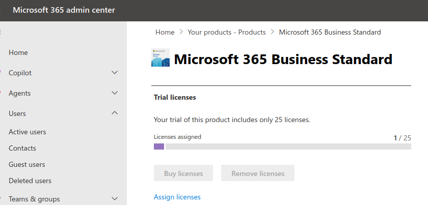

### Active Users
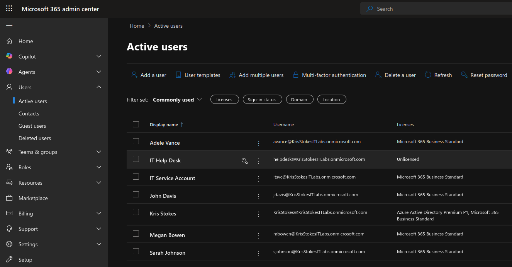

### User Created
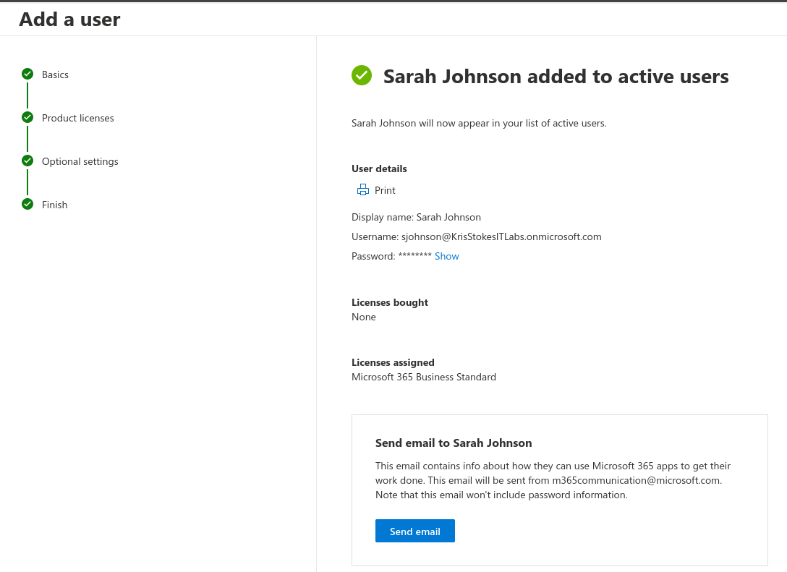

### Full User List
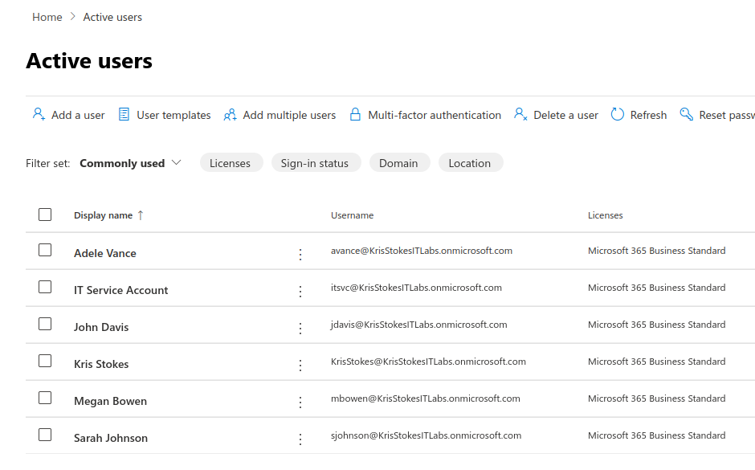

### Role Assigned
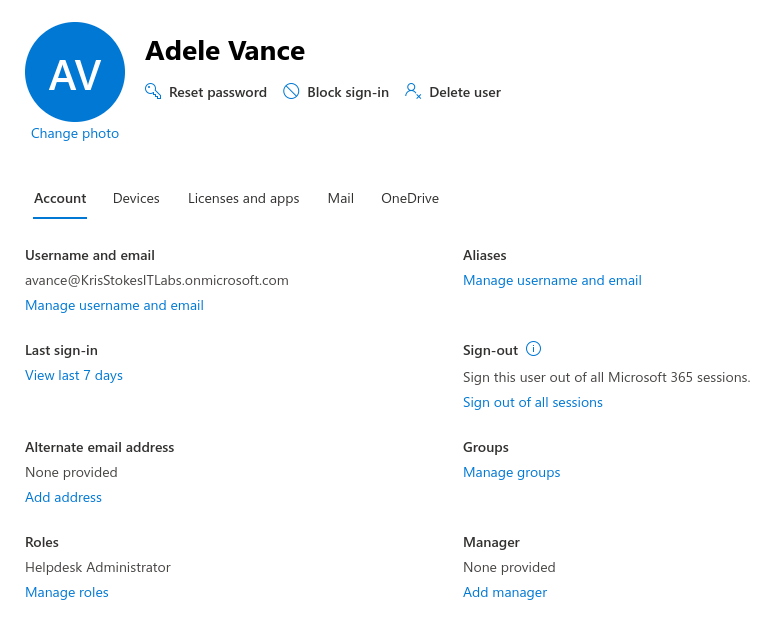

### Security Group
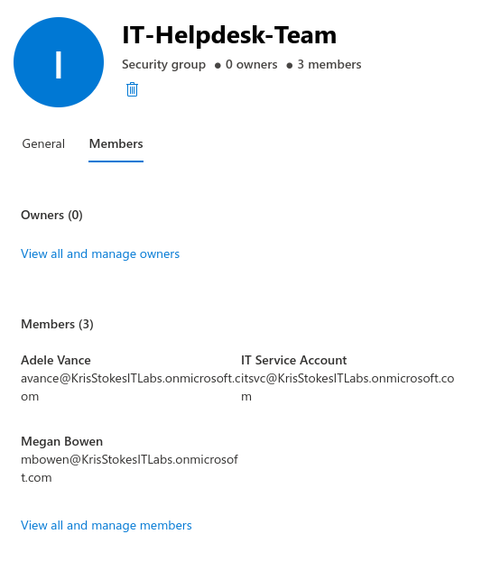

### Entra ID Users
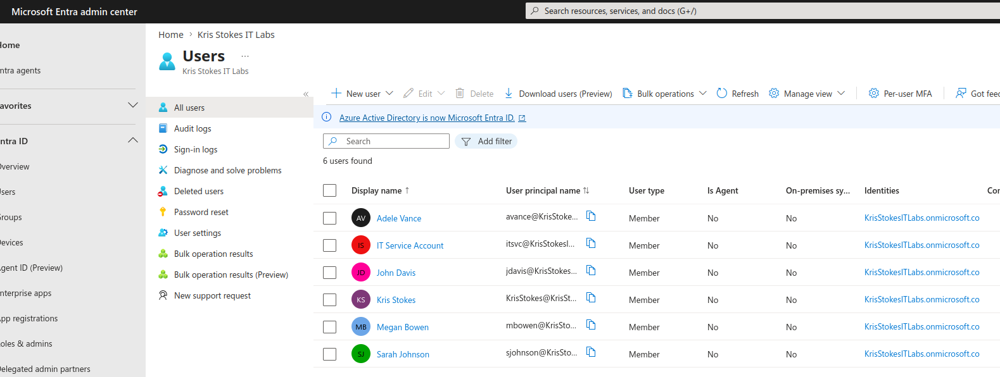

### Sign-In Logs
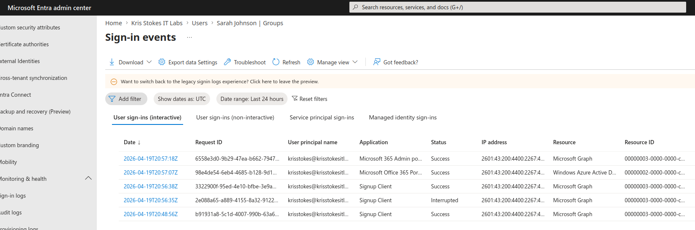

### SSPR Configuration
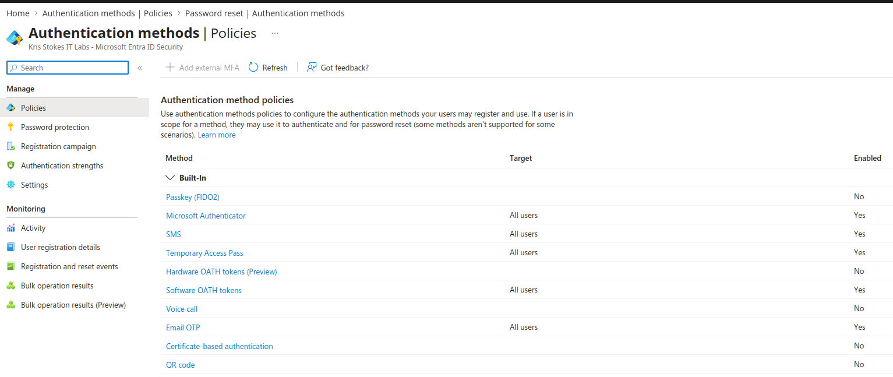

### Conditional Access Policy
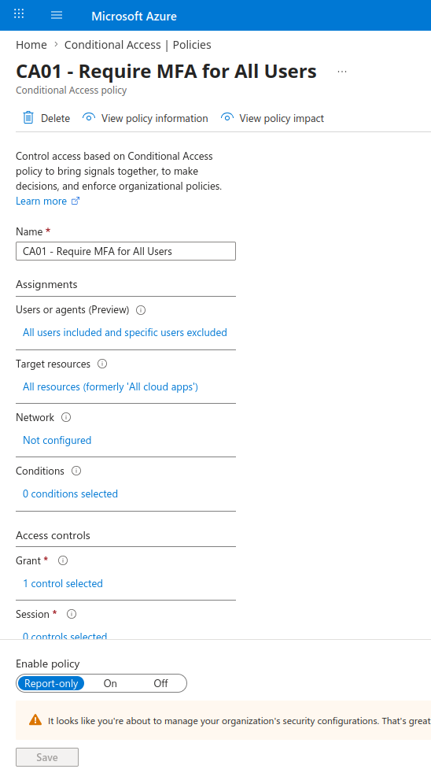

### CA Policies List
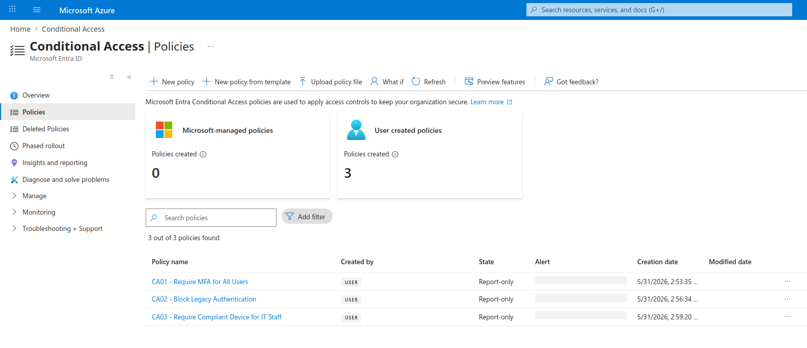

### Exchange Mailboxes
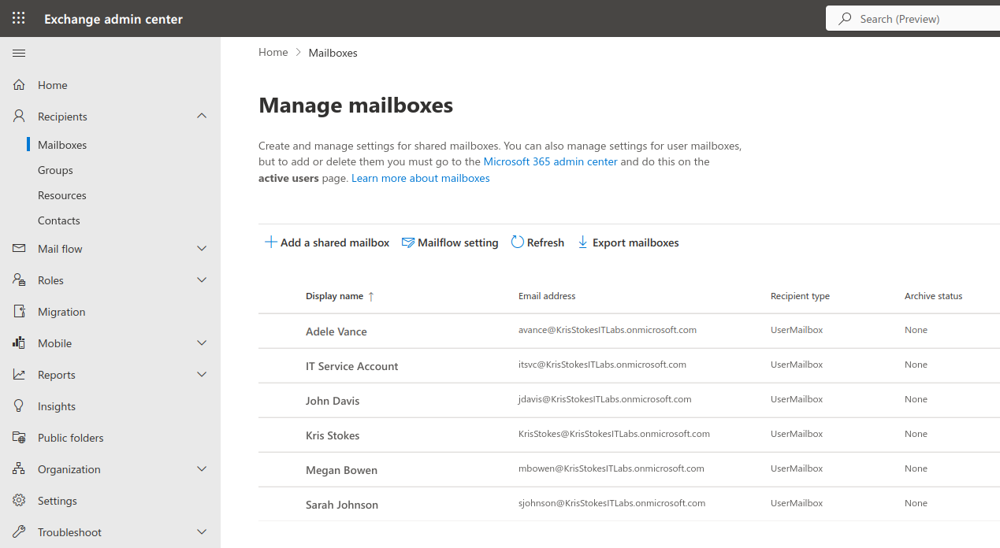

### Shared Mailbox
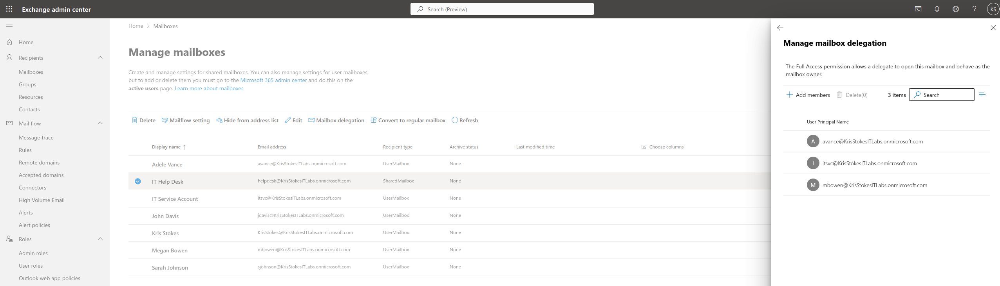

### Distribution List
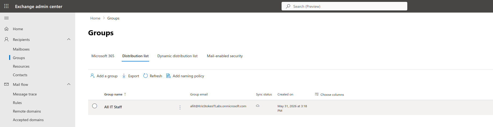

### Mail Flow Rule
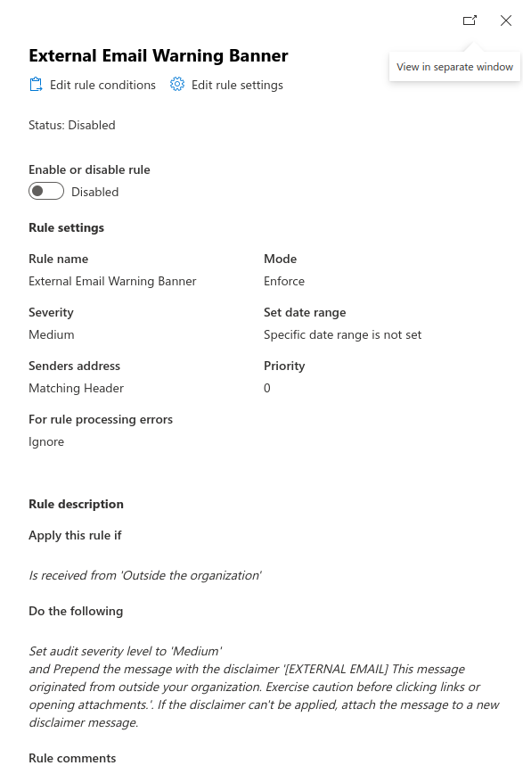

### Teams Admin
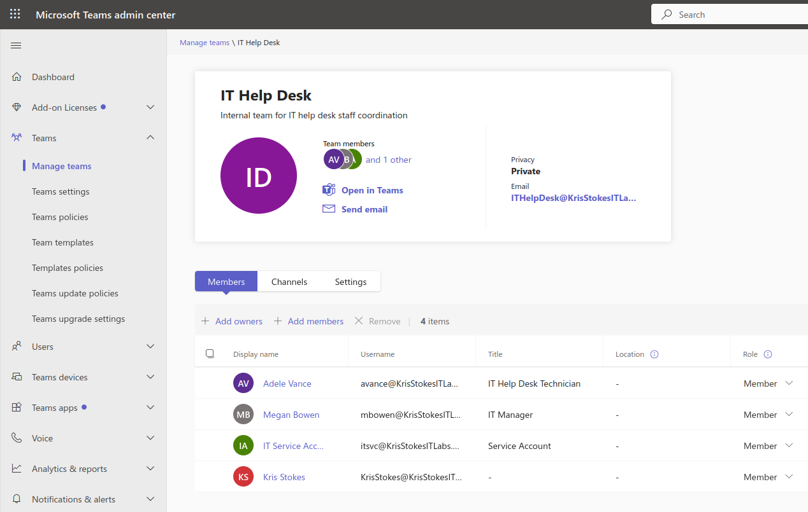

### Meeting Policy
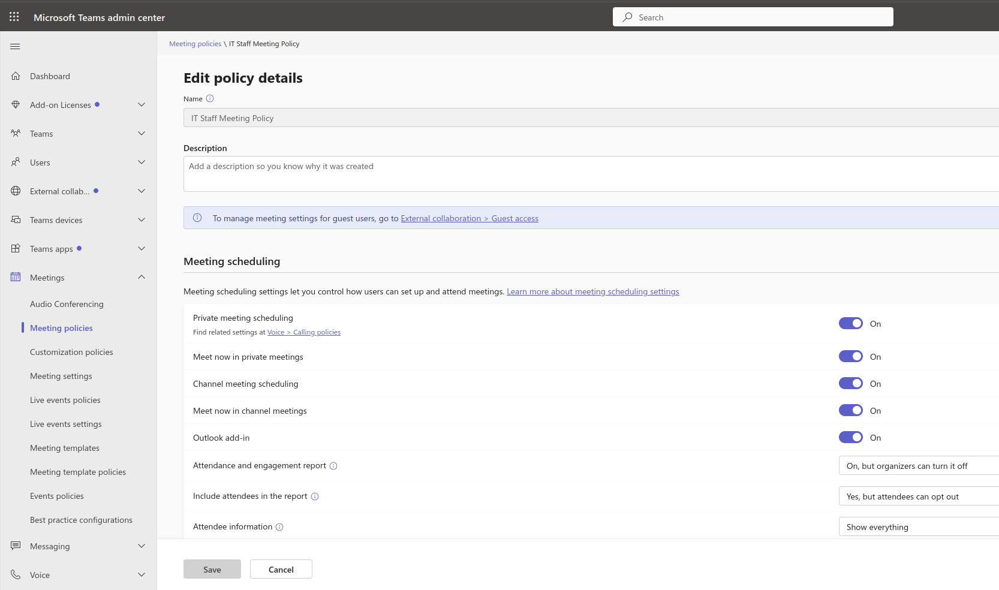

### Defender Anti-Phishing
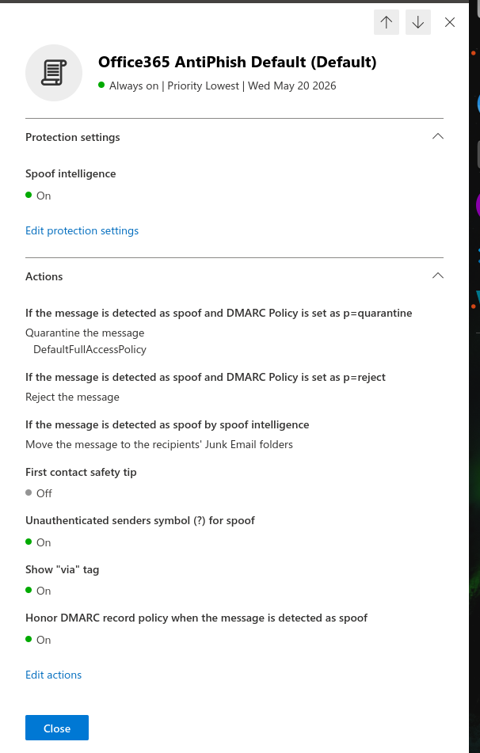

### Defender Overview
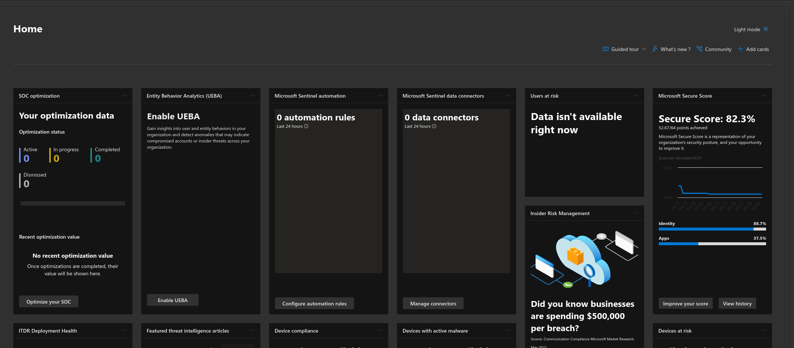

### Secure Score
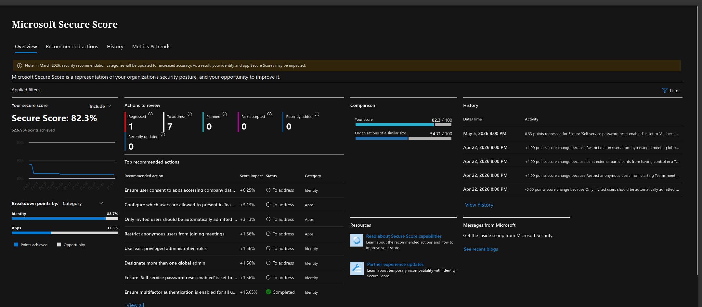
